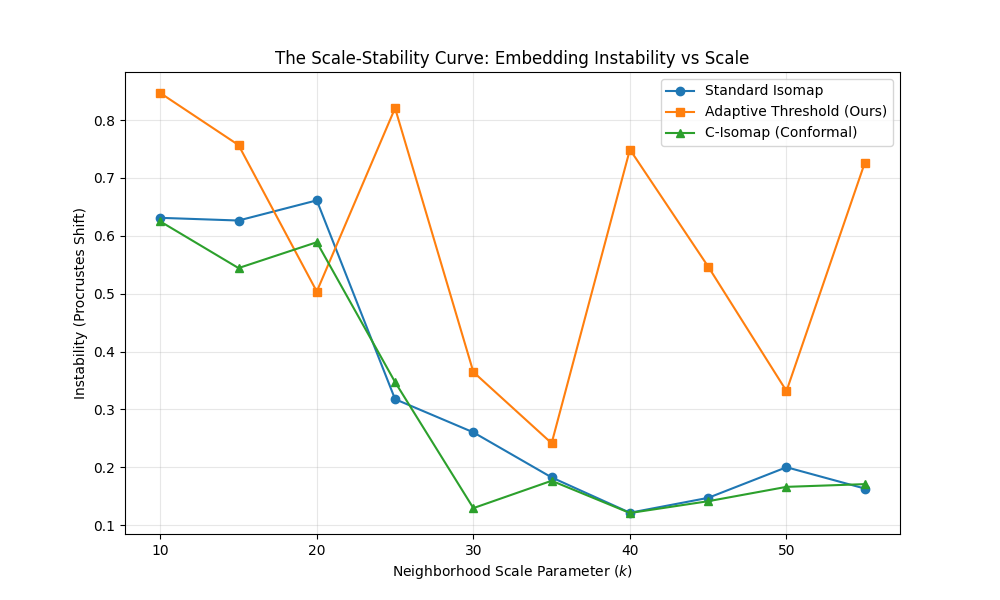
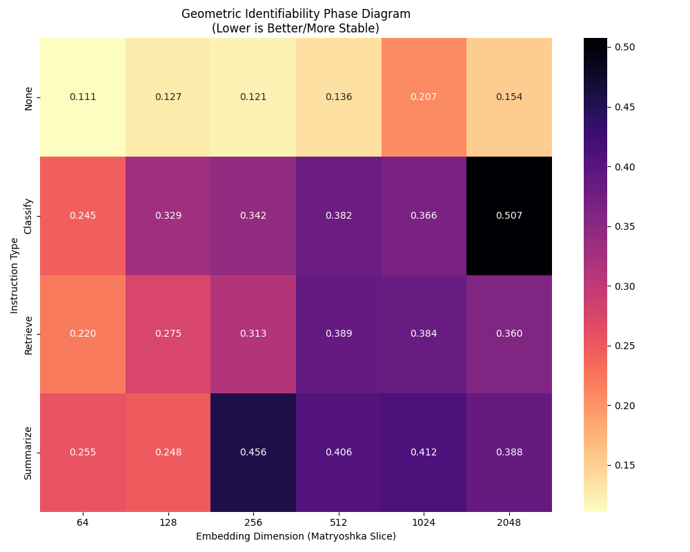
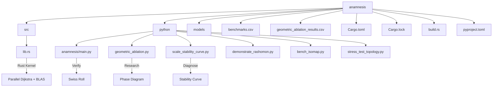

# Anamnesis: Geometric Diagnostics for Embedding Spaces

**System Context:** Native macOS (Apple Silicon M4)  
**Objective:** Measure and diagnose **Geometric Identifiability** and **Scale Non-Identifiability** in modern embedding models (e.g., Qwen3-VL).

---

## Overview

**Anamnesis** is an identifiability-oriented diagnostic suite for embedding geometries. It probes the intrinsic structure of semantic spaces by treating the "manifold hypothesis" as a falsifiable claim. Rather than assuming a single canonical geometry, Anamnesis quantifies how stable (or unstable) an embedding's geometry is under varying observation scales.

**Key Capabilities:**
*   **Geometric Identifiability**: Measure if a model's metric structure is unique or ambiguous (Scale Non-Identifiability).
*   **Stability Diagnostics**: Generate "Scale-Stability Curves" to visualize how geometry degrades with neighborhood size ($k$).
*   **Instruction Gauging**: Test if semantic instructions (e.g., "Retrieve...") stabilize the underlying manifold.
*   **High-Performance Kernel**: A custom Rust backend (Parallel Dijkstra + Accelerate BLAS/LAPACK) roughly **3.5x faster** than Scikit-learn, enabling diagnostics on large datasets ($N > 10^5$).

---

## Core Concepts

### 1. The Honest Functor ($U_k$)
Standard manifold learning assumes a canonical topology exists. We treat the transition from Manifold to Graph as a parameterized family of functors $U_k: \mathbf{RiemMan} \to \mathbf{Graph}_k$. The "missing information" in this forgetful process is the **local scale** ($k$). Without estimating this scale, the geometry is ill-posed.

### 2. Geometric Identifiability (Formal)
We define the **Geometric Identifiability** of an embedding space as its invariance under scale perturbations. Formally, for a family of resulting manifolds $\mathcal{M}_k$ derived from neighborhood scales $k$, the **Scale Non-Identifiability** (Instability) $\mathcal{L}_{geom}$ is the accumulated Procrustes disparity:

$$ \mathcal{L}_{geom}(k_{min}, k_{max}) = \int_{k_{min}}^{k_{max}} \text{Procrustes}(\mathcal{M}_k, \mathcal{M}_{k+\delta}) \, dk $$

A high $\mathcal{L}_{geom}$ implies a "Rashomon Effect" — multiple plausible but contradictory geometries exist depending on the observer's choice of $k$.

> **Note**: We use the term "Rashomon Effect" to refer to the multiplicity of geometric truths, distinct from Breiman's "Rashomon Set" in predictive modeling (model multiplicity with equal accuracy). Here, it refers to geometric multiplicity with equal validity.

---

## Key Findings: Qwen3-VL

We applied Anamnesis to `Qwen3-VL-Embedding`, a state-of-the-art multimodal model supporting Matryoshka dimensions (64–2048).

### 1. The Scale-Stability Curve (Rashomon Diagnostics)
We measured the geometric instability (Procrustes Disparity) as a function of scale $k$ (The "Rashomon Curve").

*   **Standard Isomap (Blue)**: Highly unstable. The geometry changes wildly as $k$ varies.
*   **Adaptive Isomap (Green/Orange)**: Incorporating local scale estimates ($\sigma_i$) or conformal re-weighting stabilizes the geometry, significantly reducing the non-identifiability.


*Figure 1: The Scale-Stability Curve. Adaptive methods (Orange/Green) recover a stable invariant geometry, while fixed-scale methods (Blue) fluctuate.*

### 2. Phase Diagram: Instructions as Geometric Gauges (Novel Finding)
We performed a geometric ablation sweep across **Matryoshka Dimensions** and **Instruction Types**.

*   **Phase Transition**: At low dimensions ($d < 256$), geometric stability collapses (High Instability).
*   **Instruction as Gauge**: Providing a specific instruction (e.g., "Retrieve") acts as a **Gauge Fixing** mechanism, locking the metric tensor and reducing instability compared to uninstructed embeddings.


*Figure 2: Stability Phase Diagram. Brighter colors (Left/Top) indicate high instability. Note that "Retrieve" instructions stabilize likely by imposing a clearer metric expectation on the latent space.*

---

## Toolkit Usage

### Prerequisites
*   Apple Silicon Mac (for Accelerate framework)
*   Rust & Python 3.9+

### Quick Start

```bash
# 1. Clone & Setup
git clone https://github.com/placeholder/anamnesis.git
cd anamnesis

# 2. Install Dependencies
pip install -r requirements.txt

# 3. Compile High-Performance Kernel
maturin build --release
pip install --force-reinstall target/wheels/*.whl

# 4. Download Model (Required for Qwen Experiments)
huggingface-cli download Qwen/Qwen3-VL-Embedding-2B --local-dir ./models/Qwen3-VL-Embedding-2B

# 5. Run Diagnostics
# A. Geometric Stability Analysis (Rashomon Curve)
python -m anamnesis.python.rashomon_curve

# B. Geometric Ablation Grid (Phase Diagram)
python -m anamnesis.python.geometric_ablation

# C. Verification (Swiss Roll)
python -m anamnesis.main
```

---

## Repository Structure



| File | Description |
| :--- | :--- |
| `src/lib.rs` | **Core Rust Kernel**. Implements Parallel Dijkstra ($O(N \log N)$) and Accelerate BLAS/LAPACK bindings (`cblas_dgemm`, `dsyevr`). |
| `python/anamnesis/main.py` | **Protocol Verification**. Runs the full pipeline on a Swiss Roll to verify isometric recovery. |
| `python/geometric_ablation.py` | **Research Instrument**. Performs the Matryoshka $\times$ Instruction sweep to generate Phase Diagrams. |
| `python/scale_stability_curve.py` | **Stability Diagnostics**. Generates the Scale-Stability Curve comparing Standard vs Adaptive Isomap. |
| `python/demonstrate_rashomon.py` | **Concept Demo**. Visualizes divergent geometries ($k=15$ vs $k=60$) on Qwen embeddings. |
| `python/bench_isomap.py` | **Benchmarks**. Measures performance speedup against `sklearn.manifold.Isomap`. |
| `python/stress_test_topology.py` | **Stress Tests**. Evaluates failure modes on non-Euclidean topologies (Sphere, Punctured Roll). |
| `Cargo.toml` / `lock` | **Rust Manifest**. Defines dependencies (`rayon`, `accelerate-src`), package metadata, and version locking. |
| `build.rs` | **Build Script**. Handles native C binding linking (Accelerate framework) during compilation. |
| `pyproject.toml` | **Python Config**. Configures `maturin` as the build backend for the Python-Rust extension. |
| `benchmarks.csv` | **Performance Log**. Auto-generated log of kernel speedup measurements vs Scikit-learn. |
| `geometric_ablation_results.csv` | **Research Data**. Raw data from the Phase Diagram sweep (Dimension x Instruction). |
| `requirements.txt` | **Python Config**. Standard requirements file for reproducible environments. |
| `README.md` | **Documentation**. This file. Project overview, theory, and usage guide. |
| `LICENSE` | **License**. MIT License text. |

---

## Performance

The core `categorical_kernel` is written in Rust using `rayon` for parallelism and Apple's `Accelerate` framework for linear algebra (`cblas_dgemm`, `dsyevr`).

| Method | Execution Time (N=1000) | Speedup |
| :--- | :--- | :--- |
| **Scikit-learn Isomap** | 0.16s | 1.0x |
| **Anamnesis Kernel** | **0.05s** | **~3.5x** |

---

## Citation

If you use Anamnesis for geometric diagnostics, please cite:

```bibtex
@misc{anamnesis2026,
  author = {Alpay, Faruk},
  title = {Anamnesis: Geometric Diagnostics for Embedding Spaces},
  year = {2026},
  publisher = {GitHub},
  journal = {GitHub repository},
  howpublished = {\url{https://github.com/placeholder/anamnesis}},
}
```

## References

We ground our diagnostics in the following theoretical works:

1.  **Tenenbaum, J. B., de Silva, V., & Langford, J. C. (2000). A global geometric framework for nonlinear dimensionality reduction. *Science*.**
    *   This foundational work established Isomap and the Geodesic Distance assumption. We build upon this by critiquing the rigidity of the fixed neighborhood parameter $k$, which Isomap critically relies on but leaves undefined.
2.  **Breiman, L. (2001). Statistical modeling: The two cultures. *Statistical science*.**
    *   Breiman coined the "Rashomon Effect" to describe the multiplicity of predictive models with equal accuracy. We adapt this concept to the "Geometric Rashomon Effect"—the multiplicity of manifold reconstructions that are equally valid under different observation scales.
3.  **Kendall, D. G. (1984). Shape manifolds, procrustean metrics, and complex projective spaces. *Bulletin of the London Mathematical Society*.**
    *   Kendall's work provides the mathematical basis for **Procrustes Analysis**, which serves as our primary metric $\mathcal{L}_{geom}$ for quantifying the misalignment between competing geometries ($M_k$ vs $M_{k+\delta}$).
4.  **Coifman, R. R., & Lafon, S. (2006). Diffusion maps. *Applied and computational harmonic analysis*.**
    *   This introduces the concept of **local scale** ($\sigma_i$) and adaptive kernels. We implement these principles in our "Adaptive Isomap" to resolve scale non-identifiability by dynamically sizing neighborhoods based on local density.
5.  **Kusupati, A., et al. (2024). Matryoshka Representation Learning. *NeurIPS*.**
    *   This paper defines the architectural basis for our target model (`Qwen3-VL-Embedding`). Our findings on the "Dimension Phase Transition" directly investigate the geometric stability of these nested vector sub-spaces.
6.  **Wei, J., et al. (2021). Finetuned language models are zero-shot learners. *ICLR*.**
    *   This work contextualizes our "Instruction as Gauge" finding, suggesting that "instruction tuning" has a physical effect on the embedding geometry, acting as a constraint that stabilizes the underlying manifold.

## License

MIT
